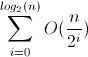

#Chop Kata

##Day 1

**Authors note**: The notes for this day were rather short, I think this is
because I wasn't in the mindset of really trying to explain the solution at this
point.

Setup nose tests and chopper that returns -1 on all calls. First assertion
error hit as expected:

```
Traceback (most recent call last):
  File "/Library/Python/2.7/site-packages/nose-1.2.1-py2.7.egg/nose/case.py", line 197, in runTest
    self.test(*self.arg)
  File "/Users/sam/dev/kata-chop/tests/chopper_tests.py", line 6, in test_chop_1_
    assert 0 == chopper.chop_1(1, [1])
AssertionError
```

Chosen implementation: iterative binary chop using a while loop. See the chop1
function.

###First implementation:

```python
def chop1(item, values):
    high = len(values)-1
    low  = 0

    while high >= low:
        mid = (high + low)/2
        if values[mid] < item:
            low = mid
        elif values[mid] > item:
            high = mid
        else:
            return mid
    return -1
```

The implementation here goes into an infinite loop. This is because we need to
update high or low to not be the mid item, but the mid item +1 or -1
respectively (this reduces the size of the range when the array is of length 1)


###Second implementation

```python
def chop1(item, values):
    high = len(values)-1
    low  = 0

    while high >= low:
        mid = (high + low)/2
        if values[mid] < item:
            low = mid + 1
        elif values[mid] > item:
            high = mid - 1
        else:
            return mid
    return -1
```

This passes all the tests given by the kata, the infinite loop is solved by
moving the new bounds in the direction of where the expected value is.

##Day 2

(today coming to you from Google campus)

I started by looking if any refactorings could be made to my existing solution.
The main thing that I felt could be done was to make it so that the tests were
not specific to the chop1 function but could instead be parameterised to take a
function, and run all the tests against that. I extracted the run\_chop
function which takes a chopper like function to test.

For todays implementation I decided that a simple recursive binary search would
be a good next implementation. This is the "other" implementation that is
commonly taught in algorithms classes, and is an implementation that I'm
familiar with.

Again I started with a simple implementation that returns -1 and hooked up
the tests to the chopper (this time called chop2) to ensure that everything was
ready to be hacked upon.

The output from nose clearly showed the first implementation still passes,
but the second one fails, as expected:

```
:!nosetests
.F
======================================================================
FAIL: chopper_tests.test_chop2
----------------------------------------------------------------------
Traceback (most recent call last):
  File "/Library/Python/2.7/site-packages/nose-1.2.1-py2.7.egg/nose/case.py", line 197, i
n runTest
    self.test(*self.arg)
  File "/Users/sam/dev/kata-chop/tests/chopper_tests.py", line 30, in test_chop2
    run_chop(chopper.chop2)
  File "/Users/sam/dev/kata-chop/tests/chopper_tests.py", line 6, in run_chop
    assert 0 == chop_function(1, [1])
AssertionError

----------------------------------------------------------------------
```

###First Implementation

```python
def chop2(item, values, min = 0, max = None):
    if max is None:
        max = len(values)-1

    mid = (max+min)/2

    if min > max:
        return -1
    elif values[mid] > item:
        return chop2(item, values, min, mid-1)
    elif values[mid] < item:
        return chop2(item, values, mid+1, max)
    else:
        return values[mid]
```

Problem: returns values[mid] rather than mid.

###Second Implementation

```python
def chop2(item, values, min = 0, max = None):
    if max is None:
        max = len(values)-1

    mid = (max+min)/2

    if min > max:
        return -1
    elif values[mid] > item:
        return chop2(item, values, min, mid-1)
    elif values[mid] < item:
        return chop2(item, values, mid+1, max)
    else:
        return mid
```

This seems to pass all the tests. As a matter of course I noted that the
calculation to compute the midpoint of the high and low values is now
duplicated, so I pulled it out into it's own method and ran the tests again.

It's worth noting that whilst I had roughly the same number of errors today as
yesterday, it took me a lot less time to actually come up with something that I
thought I could run that would be roughly correct. This is partly due to having
thought about today's solution in 'down' time yesterday, and having yesterday's
solution open on my computer whilst implementing this solution.

##Day 3

I feel pretty good about my solution from yesterday, however a quick change
that can be made is to replace the midpoint calculation with the function I
extracted out yesterday.

For today's solution my intention is to implement the binary search as a
descent through a binary tree. This is possible because the input is sorted,
the root of the tree is the midpoint of the array, and the left subtree is
given by all the nodes to the left of the midpoint, and the right subtree is
given by all the nodes to the right of the midpoint. As an example let's
consider the following example.

```
a = [1,3,5,7,9]


Tree representation:
           5
          / \
         /   \
        1     7
         \     \
          3     9

```

The reason that 1 and 7 form the second level of nodes is that the midpoint
function rounds down because of integer division.

We can clearly see that this example gives us a binary search tree, and that in
fact, all sorted arrays will form a binary tree with the search tree property
(the left subtree of any node contains only values less than or equal than it,
and the right subtree of any node contains only values greater than or equal to
it)

The search algorithm over this tree will be constructed by using smaller and
smaller slices of the input array. When we hit an array of size 1 then we can
stop descending. With this explanation in mind let's start implementing!

As per the previous days I started with an empty implementation (chop3) that
returns -1 and ran the tests.

```
Traceback (most recent call last):
  File "/Library/Python/2.7/site-packages/nose-1.2.1-py2.7.egg/nose/case.py", line 197, i
n runTest
    self.test(*self.arg)
  File "/Users/sam/dev/kata-chop/tests/chopper_tests.py", line 34, in test_chop3
    run_chop(chopper.chop3)
  File "/Users/sam/dev/kata-chop/tests/chopper_tests.py", line 6, in run_chop
    assert 0 == chop_function(1, [1])
AssertionError
```

With the expected failure occuring I can start building a solution.

###First implementation

```python
def list_midpoint(values):
    return midpoint(0,len(values))

def left_subtree(values):
    return values[:list_midpoint(values)-1]

def right_subtree(values):
    return values[list_midpoint(values)+1:]

def chop3(item, values):
    if len(values) == 0:
        return -1

    mid = list_midpoint(values)

    if values[mid] > item:
        return chop3(item, left_subtree(values))
    elif values[mid] < item:
        chop_result = chop3(item, right_subtree(values))
        return mid + 1 + chop_result if chop_result != -1 else -1
    else:
        return mid
```

Before I test this, I want to explain the implementation a little. Firstly we
have functions to get the left and right subtree in our specific list based
binary search tree implementation. We also have a helper to give us the root
node, or midpiont called `list_endpoint` and then we get to the actual
solution.

We recurse left if the midponit is greater than the item we are searching for,
otherwise we recurse right. The reason for the arithmetic on the return is that
if the index in the right subtree is 0, then we must add the midpoint's position
plus one in the array, as that's where the right subtree starts. Additionally
if the result from the right subtree is -1 we must return -1 (for not found).

I then tested the implementation and the result was as follows:

```python
Traceback (most recent call last):
  File "/Library/Python/2.7/site-packages/nose-1.2.1-py2.7.egg/nose/case.py", line 197, in runTest
    self.test(*self.arg)
  File "/Users/sam/dev/kata-chop/tests/chopper_tests.py", line 34, in test_chop3
    run_chop(chopper.chop3)
  File "/Users/sam/dev/kata-chop/tests/chopper_tests.py", line 8, in run_chop
    assert 0 == chop_function(1, [1, 3, 5])
AssertionError
```

The actual returned value was `-1`. This is because the list slice on `left_subtree`
is wrong, the fix is this:


###Second implementation

```python
def list_midpoint(values):
    return midpoint(0,len(values))

def left_subtree(values):
    return values[:list_midpoint(values)]

def right_subtree(values):
    return values[list_midpoint(values)+1:]

def chop3(item, values):
    if len(values) == 0:
        return -1

    mid = list_midpoint(values)

    if values[mid] > item:
        return chop3(item, left_subtree(values))
    elif values[mid] < item:
        chop_result = chop3(item, right_subtree(values))
        return mid + 1 + chop_result if chop_result != -1 else -1
    else:
        return mid
```

This passes all the tests.


Whilst it's worth noting that again we had two implementations today, the error
on this one was fairly trivial, instead of going into an infinite loop or
returning the wrong value, the core of the algorithm was clear and a minor
error was made in how we slice through the list to get the correct subtree.

##Merits of various solutions

I think that the first two solutions are slightly preferable from a code
understanding point of view: that is that nearly everyone who's been through a
computer science degree will almost certainly be familiar with both recursive
and iterative binary search. In a functional programming language such as
Haskell I would almost certainly implement the first recursive approach tried,
as it'd be both clear to the reader, and fit nicely within the functional
programming paradigm.

The final solution definitely stretched me to consider different approaches to
a very common data structure, which is also nice to see. Given that other
algorithms are sometimes backed off a tree like structure, the sorted list as a
tree approach could be useful in other places.

I wanted to measure the relative performance of these algorithms, mostly for
curiosity's sake. It should be noted that neither of these recursive
implementations are going to benefit from tail call optimization, so they may
suffer due to that.

In order to test the performance I added a main block to the chopper.py script
to run each chopper over a large range. The script runs many tests and then
takes the average, a sample run of which is reported below:

```
<function chop1 at 0x1025af2a8> 8.63440036774e-06
<function chop2 at 0x1025af6e0> 1.08212471008e-05
<function chop3 at 0x1025bcc08> 5.14978885651e-05
```

We can see here that the recursive implementation performs only slightly worse
than the iterative implementation: this is probably due to function calls being
expensive in python. A quick google search indicates that slicing in python is
[O(k) on the size of theslice](http://wiki.python.org/moin/TimeComplexity),
which would explain why the recursive tree implementation loses.

Regarding that note on the chop3 implementation, this will have an effect on
the time complexity of the algorithm: it will only be O(log(n)) if subtree
access is constant time, which it clearly isn't. Informally:

* Given some input of size n, eliminating half of the input at a time we will
  take O(log(n)) steps to get to an input of size 1
* At step number k the size of the input is (n/(2<sup>k</sup>))
* The highest numbered step is when k = log<sub>2</sub>(n)
* The complexity of step k is O((n/(2<sup>k</sup>))) as the most expensive
  operation performed at any individual step is grabbing the subarray slice.
* The complexity is therefore expressed as 
* This works out to be O(n) time complexity
  ([Wolfram Alpha](https://www.wolframalpha.com/input/?i=sum+from+i%3D0+to+log2%28n%29+of+%28n%2F%282%5Ei%29%29))


This has been a pretty interesting exercise: it's made me think about different
ways to approach the same problem, recall basic concepts from algorithms
classes and apply them directly to a problem and most importantly consider
different solutions in terms of code readability and performance. As I got more
familiar with the problem space I felt that my error rate generally decreased.
